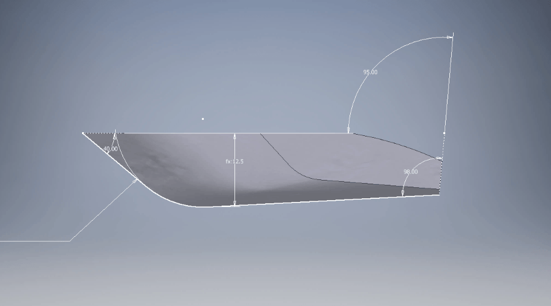
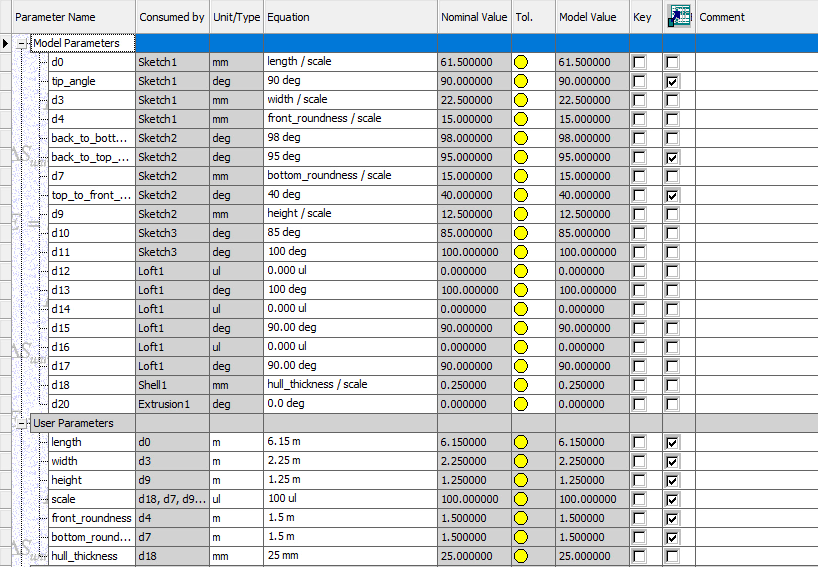
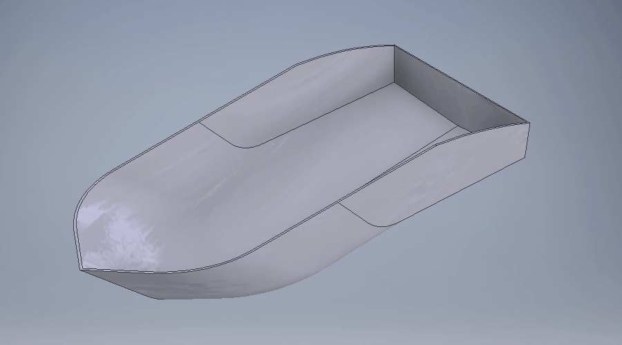

# DrowningWarnings
**Goal:** Detect and predict dangerous movements using ML. Original idea was ignited by Mikael after he saw https://www.itromso.no/nyheter/2018/05/26/Utleieb%C3%A5t-gikk-ned-i-uv%C3%A6ret-polske-turister-berget-av-lokale-redningsmenn-16775134.ece

## Problem
Generate data in small scale using a controlled environment.

## Solution
Empirical training for the model in a low scale controlled environment. 

### Hull design
The model is parametric:

The parameters don't have a proper marine jargon, but they are pretty self explanatory:

### Hull optimization
The idea is to get a low drag coefficient while keeping the overall shape similar to boats in real life.

#### Iterative morphing
Features are tweaked against the drag

#### Drag coeficient
This is a quantifier of the resistance of the hull to a fluid environment. For example ([1](https://en.wikipedia.org/wiki/Drag_coefficient)):

    0.23	Tesla Model 3
    0.33	BMW E30 3 Series 
    0.58	Jeep Wrangler TJ 
    1.00	road bicycle plus cyclist, touring position
    1.40	Formula 1
    

#### Results
Placeholder for results

## Future work
- Wave generation pool
- IoT gyro/accel
- Prediction model design and train
- Prototype of "prediction alert" box
